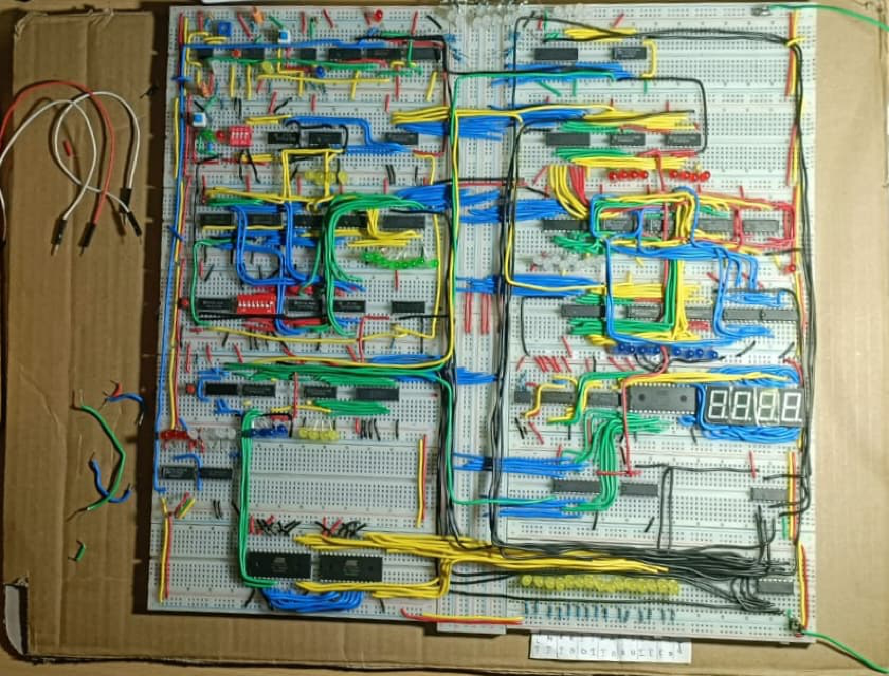
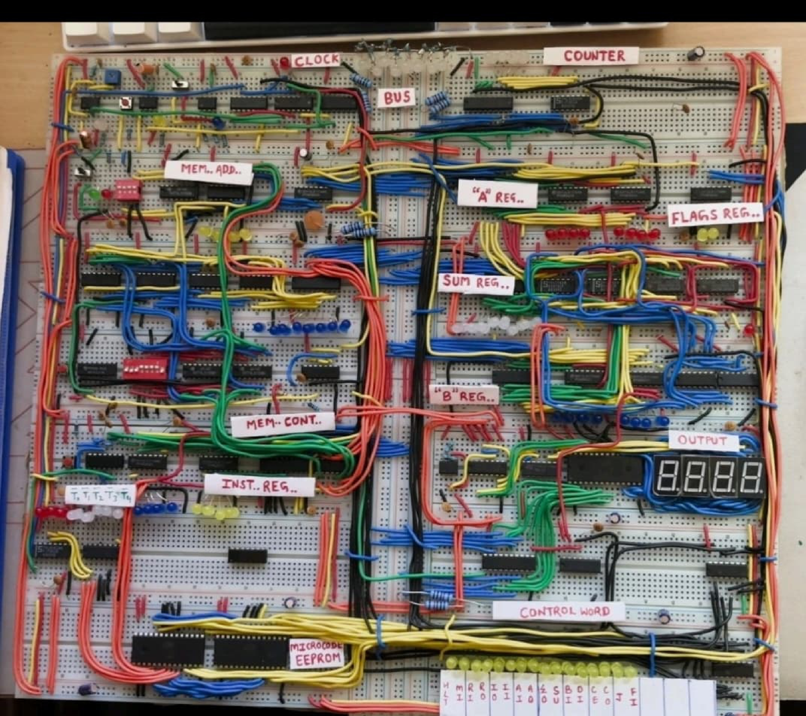
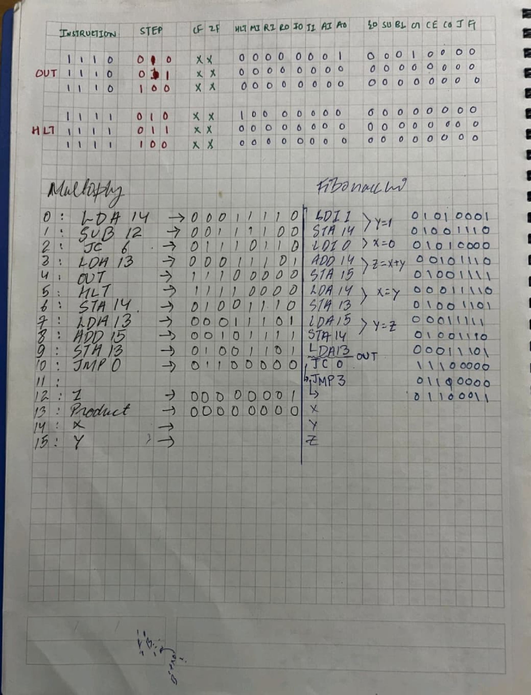
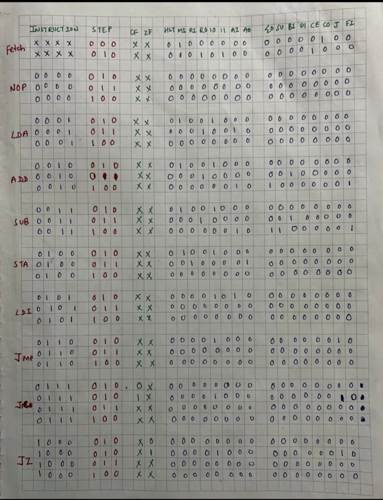

# 🖥️ 8-Bit Digital Logic Computer

This repository showcases the design and construction of a fundamental 8-bit computer built using basic digital circuits. It's an excellent resource for learning about digital electronics, computer architecture, and how data is processed and instructions are executed—bit by bit.

---

## 📘 Overview

An 8-bit computer processes data in 8-bit chunks, meaning its Arithmetic Logic Unit (ALU), registers, and data bus all handle 8-bit values. The system operates through the fetch-decode-execute cycle, where:

* **Clock Circuit**: Provides timing signals to synchronize operations.
* **Registers**: Temporarily store and manage data during computation.
* **ALU**: Performs basic arithmetic and logic operations like addition, subtraction, AND, OR, and XOR.
* **Control Unit**: Decodes instructions and coordinates the activities of different components.
* **Memory**: Divided into RAM (stores temporary data) and ROM (holds permanent instructions).
* **Bus System**: Allows communication between components.
* **I/O Devices**: Provide interaction with the user.

---

## 📺 Project Video

Watch a demonstration and explanation of the project:

---

## 🧠 Key Components

### 1. **Registers**
* **Accumulator (A)**: Stores intermediate results.
* **Instruction Register (IR)**: Holds the current instruction.
* **Program Counter (PC)**: Keeps track of the next instruction to execute.

### 2. **Arithmetic Logic Unit (ALU)**
* Performs operations such as addition, subtraction, AND, OR, and XOR on 8-bit values.

### 3. **Control Unit**
* Decodes instructions and generates control signals to coordinate the operation of the computer.

### 4. **Memory**
* **RAM**: Stores temporary data and running programs.
* **ROM**: Holds permanent instructions like a bootloader or microcode.

### 5. **Bus System**
* **Data Bus**: Transfers data between components.
* **Address Bus**: Selects memory locations.
* **Control Bus**: Manages read and write operations.

### 6. **Input/Output Devices**
* Devices like switches, LEDs, and displays that provide interaction with the user.

---

## 📷 Visual Reference

### 🔌 Raw Circuit

### 🏷️ Labeled Circuit

### 🧾 Instruction Set

The following diagrams illustrate the instruction set architecture used by the 8-bit computer:

| Instruction Set Page 1                             | Instruction Set Page 2                             |
| -------------------------------------------------- | -------------------------------------------------- |
|  |  |

---

## 📚 Research Document

For theoretical background, micro-operations, and design principles, refer to the research paper:

👉 [Download research_document.pdf](https://github.com/anjalipatel-010/8Bit-Digital-Logic-Computer/raw/main/research_document.pdf)

---

